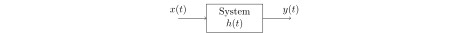

[Back](../../contents.md)
# Signals and Systems

## Signals
Signals are functions of independent variables. Signals can be classified in several ways. The most important way of classifying signals is 'continuous-time' and 'discrete-time' signals. Other ways of classifying signals are:
- Periodic and Aperiodic Signals
- Deterministic and Random Signals
- Causal, Non-causal and Anti-causal Signals
- Even and Odd Signals
- Energy and Power Signals

Some standard signals are shown.

## Systems
A system can be viewed as any process that results in the transformation of signals. Thus, a system has an input signal and an output signal which is related to the input through the system transformation.

**Impulse response** of a system is the response or output of a system when the input given is an impulse signal. In the below system, \(h(t)\) is the impulse response of the system.

Just like signals, systems can also be classified based on several properties. These properties are:
- Static and Dynamic Systems
- Linear and Non-linear Systems
- Time Variant and Time Invariant Systems
- Causal and Non-causal Systems
- Stable and Unstable Systems (BIBO)
- Invertible and Non-invertible Systems

Systems which are linear and time invariant can be scaled, superposed and transposed with respect to time. These properties provide the flexibility and convenience of operating on the corresponding systems giving them a special status. Such systems are called Linear Time Invariant (LTI) Systems.

## Convolution
If a system has impulse response \(h(t)\) and a signal \(x(t)\) is passed through the system, the output of the system, \(y(t)\), is the convolution \(x(t)\) and \(h(t)\).

\[y(t)=x(t)\ast h(t)=\int_{\tau=-\infty}^{\infty}x(\tau)h(t-\tau)d\tau\]

The same operation is also valid for disctere signals. The convolution of discrete signals \(x[n]\) and \(h[n]\) will be \(y[n]\).

\[
y[n]=x[n]\ast h[n]=\sum_{k=-\infty}^{\infty}x[k]h[n-k]
\]

Convolution is a commutative, distributive and associative operation.

### Correlation
Correlation is another operation used for signals, that is used to check the similarity between signals with respect to the time delay. The two types of correlateions are 'auto-correlation' and 'cross-correlation'. Mathematically, cross-correlation is given by

\[\mathcal{R}_{xy}(t)=\sum_{-\infty}^{\infty}x(\tau)y(\tau-t)\]

When we substitute \(x(t)=y(t)\), and do it for a single signal, we get the auto-correlation. Cross-correlation is not commutative or associative but it is distributive. It follows properties like:
- \(\mathcal{R}_{xy}(m)= \mathcal{R}_{yx}(-m)\)
- \(|\mathcal{R}_{xy}(m)|\le\sqrt{\mathcal{R}_{xx}(0)\mathcal{R}_{yy}(m)}=\sqrt{E_xE_y}\)

## Fourier Series
### Trigonometric Fourier Series
Any periodic signal, continuous or disctere, can be expressed as sum of sinusoidal signals with periods that are integral multiples of the period of given signals. Hence a periodic signal \(x(t)\) can be expressed as
\[x(t)=A_0+\sum_{n=1}^N\left(A_n\cos{\left(2\pi\frac{n}{T}t\right)}+B_n\sin{\left(2\pi\frac{n}{T}t\right)}\right)\]

### Exponential Fourier Series
Since trigonometric quantities are very closely related with exponentials, it is possible to generalise the trigonometric form of the Fourier Series to an exponential one.
\[x(t)=\sum_{n=-\infty}^\infty C_ne^{jnt}\]

The expression for \( C_n \) can be found to be:
\[C_n=\frac{1}{2\pi}\int_{-\pi}^\pi x(t)e^{-jnt}dt\]

## Fourier Transform
The Fourier transforms signals from time domain to frequency domain. It works for continuous as well as discrete signals, and always gives a continuous output. Fourier Transform of continuous signals is aperiodic, and for discrete signals, it is periodic.

#### Continuous Time Fourier Series
\[\begin{split}
\mathcal{F}\left(x(t)\right)=X(f)&=\int_{-\infty}^{\infty}x(t)e^{-j2\pi ft}dt\\
\mathcal{F}^{-1}(X(f))=x(t)&=\int_{-\infty}^{\infty}X(f)e^{j2\pi ft}df
\end{split}\]

#### Discrete Time Fourier Series
\[\begin{split}
\mathcal{F}\left(x[n]\right)=X(f)&=\sum_{-\infty}^{\infty}x[n]e^{-j2\pi fn}\\
\mathcal{F}^{-1}(X(f))=x[n]&=\int_{0}^{2\pi}X(f)e^{j2\pi fn}df
\end{split}\]

### Dirichlet Condition
Fourier Transform for a signal exist only if it satisfies the Dirichlet Conditions.
- Signal should be absolutely integrable or should have finite energy \[ \int_{-\infty}^\infty|x(t)|dt<\infty \]
- Signal should have finite number of discontinuities
- Signal should have finite number of maxima and minima

### Properties of Fourier Transform
- Linearity
\[\mathcal{F}\left(\alpha x_1(t)+\beta x_2(t)\right)=\alpha X_1(f)+\beta X_2(f)\]
- Time Reversal
\[\mathcal{F}(x(-t))=X(-f)\]
- Conjugation
\[\mathcal{F}(x^\ast(t))=X^\ast(f)\]
- Time Shifting
\[\mathcal{F}(x(t-t_0))=e^{-j2\pi ft_0}X(f)\]
- Time Scaling
\[\mathcal{F}(x(at))=\frac{1}{|a|}X\left(\frac{f}{a}\right)\]
- Frequency Shifting
\[\mathcal{F}(e^{\pm j2\pi f_0t}x(t))=X(f\mp f_0)\]
- Convolution in Time
\[\mathcal{F}(x_1(t)*x_2(t))=X_1(f)X_2(f)\]
- Convolution in Frequency
\[\mathcal{F}(x_1(t)x_2(t))=\frac{1}{2\pi}\left[X_1(j\omega)*X_2(j\omega)\right]\]
- Differentiation in Time
\[\begin{split}
\mathcal{F}\left(\frac{dx(t)}{dt}\right)&=j\omega X(j\omega)\\
\mathcal{F}\left(\frac{d^kx(t)}{dt^k}\right)&=(j\omega)^kX(j\omega)
\end{split}\]
- Differentiation in Frequency
\[\begin{split}
\mathcal{F}\left(tx(t)\right)&=j\frac{dX(j\omega)}{d\omega}\\
\mathcal{F}\left(t^nx(t)\right)&=j^n\frac{d^nX(j\omega)}{d\omega^n}
\end{split}\]
- Parseval's Theorem
\[\int_{-\infty}^\infty\left|x(t)\right|^2dt=\frac{1}{2\pi}\int_{-\infty}^\infty\left|X(f)\right|^2df=\int_{-\infty}^\infty\left|X(2\pi f)\right|^2df\]
